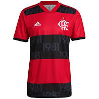
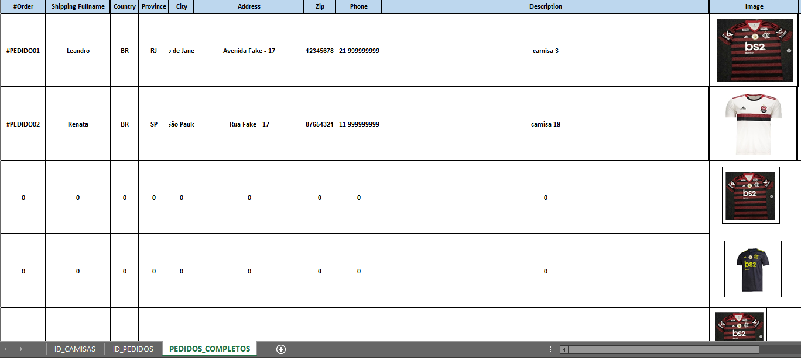

# Excel - Flamengo

  <a href="www.linkedin.com/in/marcoauréliopedroza/">
      Linkedin</a>

<a href="mailto:marco.aurelio.p@hotmail.com">
 &nbsp; E-mail</a>

- Sales Automation with Excel Spreadsheet

The manufacturer needed every order to be sent with the image of the t-shirt to which it was referring!

## Overview:

